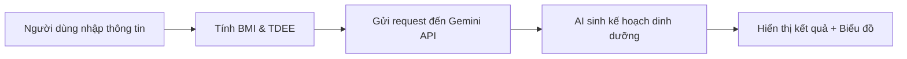

<h2 align="center">
    <a href="https://dainam.edu.vn/vi/khoa-cong-nghe-thong-tin">
    🎓 Faculty of Information Technology (DaiNam University)
    </a>
</h2>
<h2 align="center">
   NETWORK PROGRAMMING - FINAL PROJECT
</h2>
<div align="center">
    <p align="center">
        
        
        
    </p>

[](https://www.facebook.com/DNUAIoTLab)
[](https://dainam.edu.vn/vi/khoa-cong-nghe-thong-tin)
[](https://dainam.edu.vn)

</div>

---

# 🍽️ AI-Powered Meal Planner by BMI

> **Ứng dụng Flask tích hợp Google Gemini API để tạo kế hoạch dinh dưỡng cá nhân hóa dựa trên chỉ số BMI**

## 📋 Mục lục

- [Giới thiệu](#-giới-thiệu-hệ-thống)
- [Tính năng chính](#-tính-năng-chính)
- [Công nghệ sử dụng](#-công-nghệ-sử-dụng)
- [Kiến trúc hệ thống](#-kiến-trúc-hệ-thống)
- [Cài đặt và chạy](#-hướng-dẫn-cài-đặt--chạy)
- [Hướng dẫn sử dụng](#-hướng-dẫn-sử-dụng)
- [API Documentation](#-api-documentation)
- [Screenshots](#-screenshots)
- [Thông tin liên hệ](#-thông-tin-liên-hệ)


---

## 🎯 Giới thiệu hệ thống

**AI Dinh Dưỡng Thông Minh** là ứng dụng web giúp người dùng xây dựng kế hoạch ăn uống khoa học và cá nhân hóa thông qua việc kết hợp:

- **Tính toán BMI (Body Mass Index)** theo tiêu chuẩn WHO
- **Ước lượng nhu cầu calo hàng ngày** dựa trên công thức Mifflin-St Jeor
- **Trí tuệ nhân tạo Gemini 2.5 Pro** để tạo thực đơn chi tiết 7 ngày

### 🔄 Quy trình hoạt động



1. **Input**: Người dùng nhập chiều cao, cân nặng, giới tính, độ tuổi, mức độ vận động, mục tiêu thể hình
2. **Processing**: Hệ thống tính toán BMI, phân loại thể trạng và ước lượng TDEE (Total Daily Energy Expenditure)
3. **AI Generation**: Dữ liệu được gửi đến Gemini API để sinh kế hoạch ăn uống thông minh
4. **Output**: Hiển thị thực đơn 7 ngày với đầy đủ thông tin dinh dưỡng và biểu đồ trực quan

---

## ⚡ Tính năng chính

### 🧮 Tính toán sức khỏe
- ✅ Tính chỉ số BMI và phân loại theo chuẩn WHO
- ✅ Ước lượng TDEE dựa trên công thức Mifflin-St Jeor
- ✅ Điều chỉnh calo theo mục tiêu (giảm/tăng/giữ cân)

### 🤖 AI-Powered Features
- ✅ Sinh kế hoạch ăn uống 7 ngày tự động
- ✅ Cân đối tỷ lệ Protein/Carbs/Fats phù hợp
- ✅ Đề xuất bài tập thể dục kèm theo
- ✅ Lời khuyên dinh dưỡng cá nhân hóa

### 📊 Trực quan hóa dữ liệu
- ✅ Giao diện responsive, thân thiện người dùng

### 💾 Quản lý dữ liệu
- ✅ Lưu trữ kế hoạch dưới dạng JSON
- ✅ Xuất file PDF (tính năng mở rộng)
- ✅ Lịch sử tra cứu (tính năng tương lai)

---

## 🛠️ Công nghệ sử dụng

### Backend


### Frontend


### Tools & Libraries
| Library | Version | Mục đích |
|---------|---------|----------|
| Flask | 3.0+ | Web framework |
| Requests | 2.31+ | HTTP client |
| Python-dotenv | 1.0+ | Environment variables |
| Pandas | 2.0+ | Data processing |
| Google Generative AI | 0.3+ | Gemini API integration |

---

## 🏗️ Kiến trúc hệ thống

```
┌─────────────────┐
│  Web Browser    │
│  (Frontend)     │
└────────┬────────┘
         │ HTTP Request
         ▼
┌─────────────────┐
│  Flask Server   │
│  (app.py)       │
├─────────────────┤
│  - BMI Calc     │
│  - TDEE Calc    │
│  - API Handler  │
└────────┬────────┘
         │ API Call
         ▼
┌─────────────────┐
│  Gemini API     │
│  (Google Cloud) │
└─────────────────┘
```

### Luồng dữ liệu chi tiết

1. **Client Request**: Browser gửi POST request với form data
2. **Flask Processing**: 
   - Validate input
   - Tính BMI = weight / (height²)
   - Tính TDEE = BMR × Activity Factor
3. **API Integration**:
   - Format prompt cho Gemini
   - Gửi request với API key
   - Parse JSON response
4. **Response Rendering**:
   - Render template với dữ liệu
   - Inject JavaScript charts
   - Return HTML page

---

## 🚀 Hướng dẫn cài đặt & chạy

### Yêu cầu hệ thống
- Python 3.9 trở lên
- pip (Python package manager)
- Git
- Google Gemini API Key ([Đăng ký tại đây](https://ai.google.dev/))

### Bước 1: Clone repository

```bash
git clone https://github.com/<your-username>/bmi-diet-planner-gemini.git
cd bmi-diet-planner-gemini
```

### Bước 2: Tạo môi trường ảo (khuyến nghị)

**Windows:**
```bash
python -m venv venv
venv\Scripts\activate
```

**Linux/MacOS:**
```bash
python3 -m venv venv
source venv/bin/activate
```

### Bước 3: Cài đặt dependencies

```bash
pip install -r requirements.txt
```

### Bước 4: Cấu hình API Key

Tạo file `.env` trong thư mục gốc:

```env
GEMINI_API_KEY=AIzaSyXXXXXXXXXXXXXXXXXXXXXXXXXXXXXXXX
FLASK_ENV=development
FLASK_DEBUG=True
```

> ⚠️ **Lưu ý**: Không commit file `.env` lên Git. Đã có trong `.gitignore`

### Bước 5: Chạy ứng dụng

```bash
python app.py
```

Hoặc với Flask CLI:

```bash
flask run
```

Mở trình duyệt tại: **http://localhost:5000**

### Bước 6: Build production (Optional)

```bash
# Set production environment
export FLASK_ENV=production

# Run with Gunicorn
gunicorn -w 4 -b 0.0.0.0:5000 app:app
```

---

## 📖 Hướng dẫn sử dụng

### 1. Truy cập ứng dụng

Mở trình duyệt và truy cập `http://localhost:5000`

### 2. Nhập thông tin cá nhân

| Trường | Mô tả | Ví dụ |
|--------|-------|-------|
| Chiều cao | Đơn vị: cm | 170 |
| Cân nặng | Đơn vị: kg | 65 |
| Giới tính | Nam/Nữ | Nam |
| Tuổi | Đơn vị: năm | 25 |
| Hoạt động | Mức độ 1-5 | 3 (Trung bình) |
| Mục tiêu | Giảm/Giữ/Tăng cân | Giảm cân |

### 3. Nhận kết quả

Hệ thống sẽ hiển thị:
- ✅ Chỉ số BMI và đánh giá thể trạng
- ✅ Nhu cầu calo hàng ngày
- ✅ Kế hoạch ăn uống 7 ngày chi tiết
- ✅ Biểu đồ trực quan
- ✅ Lời khuyên tập luyện

### 4. Lưu kế hoạch

Click nút **"Tải xuống PDF"** hoặc **"Lưu kế hoạch"** để export dữ liệu.

---

## 🔌 API Documentation

### Endpoint: `/calculate`

**Method:** `POST`

**Request Body:**
```json
{
  "height": 170,
  "weight": 65,
  "gender": "male",
  "age": 25,
  "activity": 3,
  "goal": "lose"
}
```

**Response:**
```json
{
  "bmi": 22.5,
  "classification": "Bình thường",
  "tdee": 2200,
  "meal_plan": {
    "day_1": {...},
    "day_2": {...}
  }
}
```

### BMI Classification

| BMI Range | Phân loại | WHO Standard |
|-----------|-----------|--------------|
| < 18.5 | Thiếu cân | Underweight |
| 18.5 - 24.9 | Bình thường | Normal weight |
| 25.0 - 29.9 | Thừa cân | Overweight |
| ≥ 30.0 | Béo phì | Obese |

---

## 📸 Screenshots

### 1. Trang chủ - Form nhập liệu


### 2. Kết quả BMI


### 3. Kế hoạch dinh dưỡng 7 ngày


---


## 👨‍💻 Thông tin liên hệ

<table>
  <tr>
    <td align="center">
      
      <br />
      <b>Nguyễn Tuấn Anh</b>
      <br />
      <sub>Developer</sub>
    </td>
  </tr>
</table>

### Thông tin sinh viên

| Thông tin | Chi tiết |
|-----------|----------|
| 👤 **Họ và tên** | Nguyễn Tuấn Anh |
| 🎓 **Lớp** | CNTT 16-04 |
| 🏫 **Trường** | Đại học Đại Nam |
| 🏢 **Khoa** | Công Nghệ Thông Tin |


